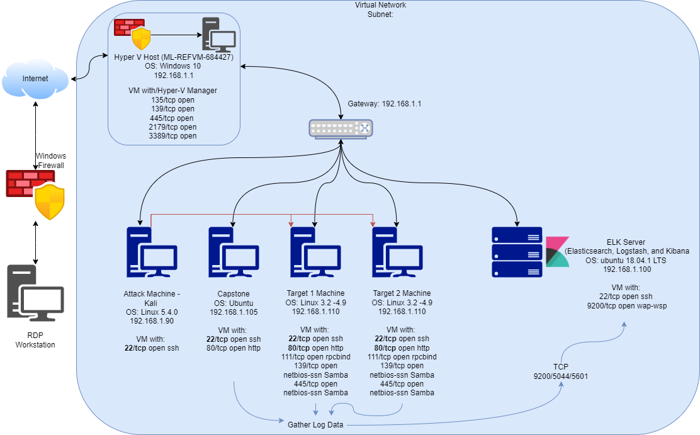

## Student Guide: Final Project Week

### Overview

You are working as a Security Engineer for X-CORP, supporting the SOC infrastructure. The SOC Analysts have noticed some discrepancies with alerting in the Kibana system and the manager has asked the Security Engineering team to investigate. 

You will start by confirming that newly created Kibana alerts are working, after which you will monitor live traffic on the wire to detect any abnormalities that aren't reflected in the alerting system. 

You are to report back all your findings to both the SOC manager and the Engineering Manager with appropriate analysis.

### Instructions

This week, you will work on your final project by completing the following tasks individually:

- **Defensive Security**: Implement alerts and thresholds you determined would be effective in Project 2.

- **Offensive Security**: Assess a vulnerable VM and verify that the Kibana rules work as expected.

- **Network Forensics**: Use Wireshark to analyze live malicious traffic on the wire.

As you work on these aspects, you will complete the following reports: 

- [Defensive Report Template](Templates/DefensiveTemplate.md)
- [Offensive Report Template](Templates/OffensiveTemplate.md)
- [Network Report Template](Templates/NetworkTemplate.md)

In addition to the above, you will be assigned to a group by your instructor on Day 1. After you complete each of the reports individually, you will work in groups to create a presentation on **one** aspect of the project: defensive, offensive, or networking. You will be provided templates to work on this presentation.  

### Lab Environment 

This week's lab environment is an Azure Classroom Lab, containing a modified version of the Project 2 network. In particular, it includes the following machines:

- **Capstone** (`192.168.1.105`): Filebeat and Metricbeat are installed and will forward logs to the ELK machine. 
   - Please note that this VM is in the network solely for the purpose of testing alerts.

- **ELK** (`192.168.1.100`): The same ELK setup that you created in Project 1. It holds the Kibana dashboards.

- **Kali** (`192.168.1.90`): A standard Kali Linux machine for use in the penetration test on Day 1. 
   - Credentials are `root`:`toor`.

- **Target 1** (`192.168.1.110`): Exposes a vulnerable WordPress server.

- **Target 2** Should be ignored until you have completed all other parts of the project. If you have completed the project and would like to integrate Target 2 into your presentation, ask your teacher for the Target 2 instructions. 

This is a diagram of the network:

 
### Task Breakdown

The following breakdown describes the tasks you will be assigned and a recommended timeline for achieving each milestone. 

#### Day 1: Target 1

After your instructor reviews the project overview and demonstrates how to use `wpscan` to assess a WordPress target, you will configure alerts in Kibana and test the alerts by repeating attacks against the Capstone VM. Then, you will begin your assessment of the first vulnerable VM: Target 1.

- [Attacking Target 1](Analysis_Complete/Red Team_Summary of Operations.pdf)

#### Day 2: Target 1

On Day 2, you will complete your assessment of Target 1. If you completed this task, you may move on to the Wireshark analysis.

- [Assessing Target 1](Analysis Complete/Blueteam/Btso1.png)

#### Day 3: Analysis

After assessing the Target 1, you will use the Kali VM to capture and analyze traffic on the virtual network with Wireshark. You will analyze the traffic to explain the actions that users are doing on the network. After analyzing Wireshark traffic, you will spend the remainder of class completing summaries of your work, and then working in groups to begin your presentations. 

- [Network Analysis](Analysis_Complete/Wireshark Analysis.pdf)
 
### Report and Presentation Templates

To complete the project, you will need to fill out the reports and slide decks linked below. The templates are on Google Drive (you must make a copy of each).   

- **Reports:** The Defensive Report and the Offensive Report relates to the Days 1 and 2, and the Network Report relates to Day 3. You can complete these as you work through the activities, outside of class, or on Day 3, during the time reserved for completing the project deliverables. The reports must be completed individually.

   - [Defensive Report Template](Analysis_Complete/Blue Team_Summary of Operations.pdf)
   - [Offensive Report Template](Analysis Complete/Red Team_Summary of Operations.pdf)
   - [Network Report Template](Analysis Complete/Wireshark Analysis.pdf)

- **Presentation:** On Day 3, you will work in groups of three to six to complete **one** of the three slide decks below. On Day 4, you will present as a group: 

   - [Offensive Presentation Template](https://docs.google.com/presentation/d/19ouk_AS16V-f1KiJ3FTnNpJ4SJn1QQG3vkKukEN1NvU/edit#slide=id.g630a814dc5_0_53)
   - [Defensive Presentation Template](https://docs.google.com/presentation/d/1LP9TBdUYlWut3Qu4Czf618i-kg_qjjxkbnWLNTSdJBk/edit#slide=id.g630a814dc5_0_53)
   - [Network Presentation Template](https://docs.google.com/presentation/d/1LLh9dyrXNkWLqcsOnu5C_LOFDm_1EuKSf7y-Z7DwXn8/edit#slide=id.g630a814dc5_0_53)

---

© 2020 Trilogy Education Services, a 2U, Inc. brand. All Rights Reserved.  
